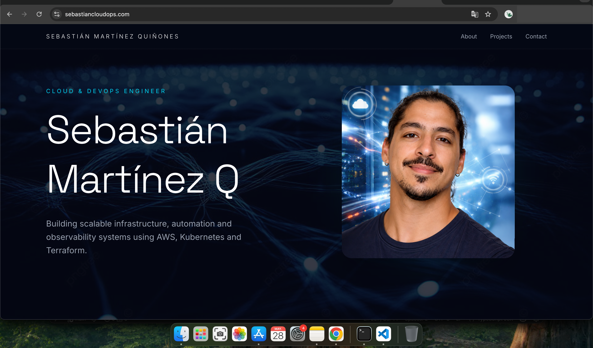

# Sebastián CloudOps Portfolio

Modern cloud and DevOps portfolio built with Next.js, Tailwind CSS and Framer Motion.

## 🌐 Live Website

sebastiancloudops.com

---

## ✨ Features

* Modern SaaS-inspired UI
* Smooth scrolling experience
* Interactive projects carousel
* Responsive layout
* Animated transitions
* Glassmorphism design
* Cloud & DevOps focused presentation

---

## 🛠️ Tech Stack

* Next.js
* TypeScript
* Tailwind CSS
* Framer Motion
* React Icons
* Lucide React

---

## ☁️ Deployment & Infrastructure

* Hosted on Vercel
* Custom domain configured with DNS management
* HTTPS enabled automatically
* Optimized global delivery through Vercel Edge Network

---

## 📂 Featured Projects

### Canary Deployment on AWS EKS

Blue/Green deployment strategy using Kubernetes ingress, AWS ALB weighted routing and real-time monitoring.

### Terraform AWS Infrastructure

Provisioned scalable AWS infrastructure including VPC, subnets, EKS cluster and networking resources.

### Monitoring & Observability Stack (Prometheus)

Infrastructure metrics and deployment visualization using Prometheus and Grafana.

### Monitoring & Observability Stack (Loki)

Centralized logging with Loki, Promtail and Grafana dashboards.

---

## 🚀 Running Locally

```bash
git clone https://github.com/sebastianfernandom33-ctrl/sebastian-portfolio.git

cd sebastian-portfolio

npm install

npm run dev
```

---

## 📸 Preview



---

## 📬 Contact

* LinkedIn: linkedin.com/in/smartinez-in
* GitHub: github.com/sebastianfernandom33-ctrl

---

Built with focus on modern cloud engineering, observability and infrastructure automation.

